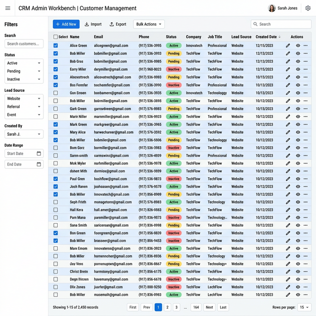
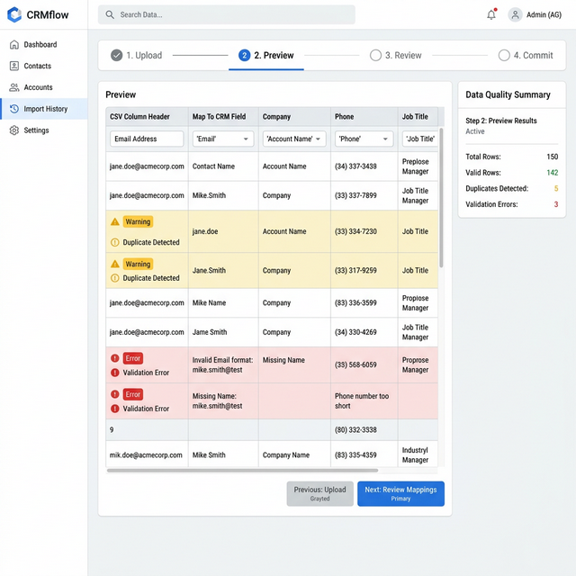

# Database View Pro

> An AI coding agent skill for building enterprise-grade, Google Sheets-style data management interfaces — dense tables, side drawers, bulk actions, import workflows, and responsive mobile views.

<p align="center">
  
</p>

## ✨ What is this?

**Database View Pro** is a skill for AI coding assistants (like [Antigravity](https://deepmind.google/technologies/antigravity/), Cursor, Windsurf, etc.) that teaches the agent how to design, build, and review **data-heavy admin workbench pages** — the kind of UI you see in CRM dashboards, back-office consoles, and operations tools.

Think of it as a **Google Sheets-meets-enterprise-admin** blueprint that your AI assistant follows when building CRUD interfaces.

## 🖼️ Preview

### Desktop — Dense Table with Filters & Toolbar

The primary view: a scannable data table with inline status badges, row selection, search, structured filters, and bulk action toolbar.

<p align="center">
  
</p>

### Detail Drawer — Edit Without Losing Context

Click a row to open a side drawer with full record details, activity timeline, and action buttons. The list stays visible so you never lose your place.

<p align="center">
  
</p>

### Mobile — Card Layout

On smaller screens, the dense table transforms into scannable cards with essential info, filter toggle, and a floating action button.

<p align="center">
  
</p>

### Import Workflow — Parse, Preview, Review, Commit

A guided multi-step import flow with column mapping, duplicate detection, validation error highlights, and a data quality summary panel.

<p align="center">
  
</p>

## 🎯 When to Use

Use this skill when your project needs:

| Scenario                      | Example                                                     |
| ----------------------------- | ----------------------------------------------------------- |
| **CRM / Sales Console**       | Lead list with status tracking, assignment, and follow-up   |
| **Back-office CRUD**          | Order management, invoice tracking, ticket queues           |
| **HR / Operations Dashboard** | Employee directory, attendance logs, payroll tables         |
| **Inventory Management**      | Product catalog with stock levels, categories, bulk updates |
| **Data Import Tools**         | CSV upload → preview → review duplicates → commit           |
| **Any Admin Table**           | Dense, filterable, editable data with drawer/modal detail   |

## 🏗️ Core Capabilities

- **Query Surface** — Global search, structured filters, presets, sorting, pagination, active filter chips
- **Record Triage** — Quick-scan table, row selection, duplicate hints, urgency/status signals
- **Detail Workflow** — Open row in drawer → inspect → edit fields → save/delete with confirmation
- **Bulk Workflow** — Multi-select → bulk delete/archive/reassign/merge/export with scope summary
- **Admin Tools** — Create record, import data, review import preview, configure visible columns
- **Display Tooling** — Responsive table ↔ card rendering, column pinning, truncation, hover detail, loading & empty states
- **Optional KPI Layer** — KPI strip, summary widgets, or charts only when they aid decision-making on the same page

## 📂 Skill Structure

```
database-view-pro/
├── SKILL.md                              # Main skill instructions
├── README.md                             # This file
├── images/                               # Visual references
│   ├── desktop-table-view.png
│   ├── drawer-detail-view.png
│   ├── mobile-card-view.png
│   └── import-workflow.png
└── references/                           # Deep-dive guides
    ├── feature-modules.md                # Module selection guide
    ├── implementation-patterns.md        # Technical patterns
    ├── mobile-ux.md                      # Mobile responsiveness
    ├── display-density.md                # Table density & layout
    ├── import-review.md                  # Import/upload flows
    ├── bulk-actions.md                   # Multi-select & batch ops
    └── permissions.md                    # Role & scope rules
```

## 🚀 Installation

### For Antigravity / Gemini CLI

Copy or clone this folder into your skills directory:

```bash
# Clone directly
git clone https://github.com/ngocthuan1989/database-view-pro.git ~/.gemini/antigravity/skills/database-view-pro
```

### For Other AI Assistants

Point your agent's skill/context configuration to the `SKILL.md` file in this repository. The references folder contains supplementary guides that the agent can read on demand.

## 🔧 How It Works

When you ask your AI assistant to build an admin page, data table, or CRUD interface, this skill provides:

1. **Decision framework** — Choose between list-only, list + modal, or list + drawer layouts
2. **Implementation patterns** — Server-backed query state, mutation boundaries, responsive rendering
3. **UX guardrails** — Scroll preservation, loading states, import error handling, color discipline
4. **Delivery checklist** — Performance, mobile readiness, URL-sharable state, visual density review

The agent reads `SKILL.md` for the core workflow and consults the `references/` guides for specific topics like bulk actions, import flows, or mobile UX.

## 📋 Design Principles

| Principle                         | Description                                                                  |
| --------------------------------- | ---------------------------------------------------------------------------- |
| **List-first**                    | The list must be useful before adding advanced features                      |
| **Context preservation**          | Drawer/modal actions never destroy list state                                |
| **Density with discipline**       | Alignment, truncation, badges, and spacing over cramming                     |
| **Mobile is a different product** | Cards on mobile, tables on desktop — don't force-shrink                      |
| **Safe mutations**                | Explicit confirmation for destructive actions, inline edit for simple fields |
| **URL as state**                  | Filters, sort, page, and selected record are URL-shareable                   |

## 🤝 Contributing

Contributions are welcome! Feel free to:

- Submit issues for bugs or feature requests
- Open PRs to improve skill instructions or add new reference guides
- Share screenshots of interfaces built with this skill

## 📄 License

MIT © [ngocthuan1989](https://github.com/ngocthuan1989)
