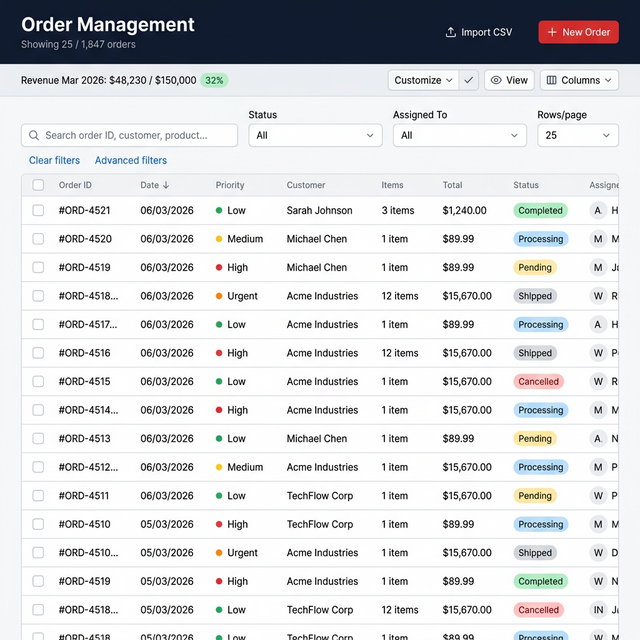
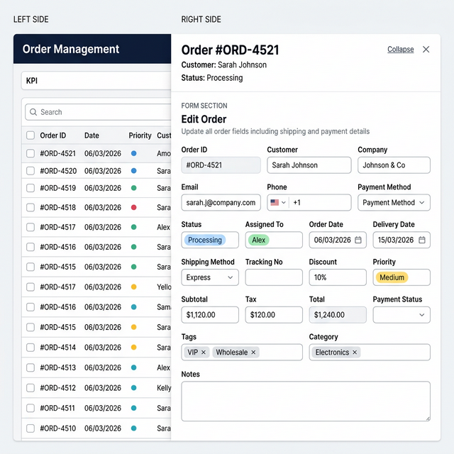
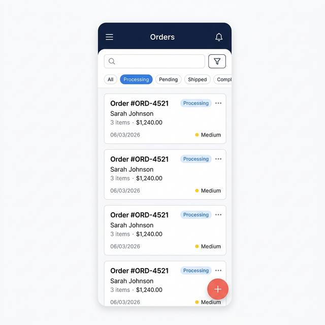

# Database View Pro

> An AI coding agent skill for building enterprise-grade admin workbench pages — dense data tables, side drawers, bulk actions, import workflows, and responsive mobile views.

<p align="center">
  
</p>

## ✨ What is this?

**Database View Pro** is a skill for AI coding assistants that teaches the agent how to design, build, and review **data-heavy admin workbench pages** — the kind of UI you see in CRM dashboards, order management consoles, HR portals, and back-office operations tools.

It provides a complete blueprint covering layout decisions, filter models, edit patterns, bulk workflows, import flows, mobile responsiveness, and performance guardrails.

## 🖼️ Preview

### Desktop — Dense Table with Filters & Toolbar

A scannable data table with row selection, priority indicators, status badges, search, structured filters, and action toolbar. The KPI strip provides at-a-glance business metrics.

<p align="center">
  
</p>

### Detail Drawer — Edit Without Losing Context

Click any row to open a side drawer with full record details, editable fields, tag inputs, and action buttons. The list stays visible so you never lose your scanning context.

<p align="center">
  
</p>

### Mobile — Card Layout

On smaller screens, the dense table transforms into scannable cards with essential info, filter chips, and a floating action button for quick record creation.

<p align="center">
  
</p>

## 🎯 When to Use

Use this skill when your project needs any kind of data-heavy operations page:

| Scenario                | Example                                                     |
| ----------------------- | ----------------------------------------------------------- |
| **CRM / Sales Console** | Lead list with status tracking, assignment, and follow-up   |
| **Order Management**    | E-commerce orders with shipping, payments, and fulfillment  |
| **Back-office CRUD**    | Invoice tracking, ticket queues, case management            |
| **HR / Operations**     | Employee directory, attendance logs, payroll tables         |
| **Inventory**           | Product catalog with stock levels, categories, bulk updates |
| **Data Import Tools**   | CSV upload → preview → review duplicates → commit           |

## 🏗️ Core Capabilities

- **Query Surface** — Global search, structured filters, presets, sorting, pagination, active filter chips
- **Record Triage** — Quick-scan table, row selection, duplicate hints, urgency / status signals
- **Detail Workflow** — Open row in drawer → inspect → edit fields → save / delete with confirmation
- **Bulk Workflow** — Multi-select → bulk delete / archive / reassign / merge / export with scope summary
- **Admin Tools** — Create record, import data, review import preview, configure visible columns
- **Display Tooling** — Responsive table ↔ card rendering, column pinning, truncation, loading & empty states
- **Optional KPI Layer** — KPI strip, summary widgets, or charts only when they aid on-page decisions

## 📂 Skill Structure

```
database-view-pro/
├── SKILL.md                              # Main skill instructions
├── README.md                             # You are here
├── images/                               # Visual references
│   ├── desktop-list-view.png             # Desktop table with filters & toolbar
│   ├── drawer-detail-view.png            # Side drawer with record details
│   └── mobile-card-view.png              # Mobile responsive card layout
└── references/                           # Deep-dive guides
    ├── feature-modules.md                # Module selection guide
    ├── implementation-patterns.md        # Technical patterns & data flow
    ├── mobile-ux.md                      # Mobile responsiveness
    ├── display-density.md                # Table density & visual hierarchy
    ├── import-review.md                  # Import / upload flows
    ├── bulk-actions.md                   # Multi-select & batch operations
    └── permissions.md                    # Role & scope rules
```

## 🚀 Installation

### For Antigravity / Gemini CLI

Clone this repository into your skills directory:

```bash
git clone https://github.com/ngocthuan1989/database-view-pro.git \
  ~/.gemini/antigravity/skills/database-view-pro
```

### For Other AI Assistants

Point your agent's skill or context configuration to the `SKILL.md` file in this repository. The `references/` folder contains supplementary guides that the agent can read on demand.

## 🔧 How It Works

When you ask your AI assistant to build an admin page, data table, or CRUD interface, this skill provides:

1. **Decision framework** — Choose between `list-only`, `list + modal`, or `list + drawer` layouts
2. **Implementation patterns** — Server-backed query state, mutation boundaries, responsive rendering
3. **UX guardrails** — Scroll preservation, loading states, import error handling, color discipline
4. **Delivery checklist** — Performance, mobile readiness, URL-shareable state, visual density review

The agent reads `SKILL.md` for the core workflow and consults the `references/` guides for specific topics.

## 📋 Design Principles

| Principle                         | Description                                                |
| --------------------------------- | ---------------------------------------------------------- |
| **List-first**                    | The list must be useful before adding advanced features    |
| **Context preservation**          | Drawer / modal actions never destroy list state            |
| **Density with discipline**       | Alignment, truncation, badges, and spacing over cramming   |
| **Mobile is a different product** | Cards on mobile, tables on desktop — don't force-shrink    |
| **Safe mutations**                | Explicit confirmation for destructive actions              |
| **URL as state**                  | Filters, sort, page, and selected record are URL-shareable |

## 🤝 Contributing

Contributions are welcome! Feel free to:

- Submit issues for bugs or feature requests
- Open PRs to improve skill instructions or add new reference guides
- Share screenshots of interfaces built with this skill

## 📄 License

MIT © [ngocthuan1989](https://github.com/ngocthuan1989)
